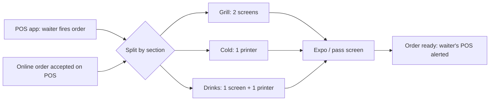

# Madar Kitchen Target Spec

2026-09-24 · draft for the owner

v2, 2026-10-08: the UI stack moves from Flutter to **React Native** on the shared Rust core, styled and structured after the React dashboard (`MadarDashboard`). The design ships first on mock data for review, before any backend wiring. Changed rows: PS-1, PS-4, new PS-8, APP-1 to APP-4, APP-9 to APP-11, AT-6, AT-7, the compatibility table and the decision log.

## How to read this spec

This is the system the kitchen display must become, whatever the code does today. Once a line is Locked, the as-built review and the gap matrix measure the code against it.

| Status | Meaning |
| --- | --- |
| Locked | You decided it. The code must match. |
| Proposed | My draft, from your answers, the code's intent, the POS design spec and the Dawam spec. It stands until you change it. |
| Open | Needs your call. |

Every requirement has an ID (for example KS-3) so the gap matrix can point at it. Drafted from your answers on 24 Sep 2026, and checked against the server (`MadarRust/src/kitchen`, `src/delivery`, the kitchen migrations), the core (`madar-core` `kds.rs`, `realtime.rs`, `lan.rs`, `device.rs`), the Flutter `feature_kds` package, the dashboard (`MadarDashboard`: `src/styles/globals.css`, `src/components/app`, `src/features/kitchen-stations`), the Slint pilot (`apps/kds-slint`), `docs/design/SPEC.md` and the Dawam Target Spec (21 Sep 2026).

Parts 2 (as built) and 3 (gaps) follow once this part is locked.

## Product shape

Madar Kitchen is the kitchen side of Madar POS. Waiters and cashiers take orders on the POS app. The kitchen app only receives, prepares, bumps and hands off. A small shop with one device doesn't install it: the POS app alone covers them.

| ID | Requirement | Status |
| --- | --- | --- |
| PS-1 | Madar Kitchen is a new standalone React Native app, separate from the POS app, with its own store listing and icon. | Locked |
| PS-2 | It is kitchen only: no ordering, checkout, tender or till. Orders come from the POS app (dine-in, takeaway) and from accepted online orders. | Locked |
| PS-3 | A shop with one device uses only the POS app; its kitchen output is the POS's own kitchen tab or a printer. | Locked |
| PS-4 | The Slint pilot (`apps/kds-slint`) is rewritten to this spec as the React Native app. Slint is dropped, and with it the Slint licence gate and the iOS 27 scene-lifecycle crash in Slint's winit 0.30. The pilot's README gotchas are kept as notes; the folder is retired once the React Native app reaches parity. Flutter `feature_kds` stays only as the POS's own kitchen tab (PS-3). | Proposed |
| PS-5 | It runs on iPad, Android tablets, Windows and Linux kitchen terminals, and macOS. | Locked |
| PS-6 | One backend, one database, one org model: sections, devices and tickets are ordinary Madar rows, shared with the POS and dashboard. | Proposed |
| PS-7 | The name is Madar Kitchen; Arabic: مطبخ مدار. | Locked |
| PS-8 | How each platform runs: iPad and Android through React Native; macOS through `react-native-macos`; Windows through `react-native-windows`. React Native has no first-party Linux target, so Linux terminals run the app's web build (`react-native-web`) full-screen in a kiosk shell. | Open |

## Branch kitchen setup

The owner decides in the dashboard, per branch, how the kitchen is laid out: how many sections, which categories each section cooks, and whether each section gets screens, printers or both.

| ID | Requirement | Status |
| --- | --- | --- |
| KS-1 | A section is a `kitchen_stations` row: name (Arabic and English), sort order, active. The word on screen is "section" (قسم); the code keeps `station`. | Proposed |
| KS-2 | A branch has one or more sections. A section holds many categories; a category belongs to one section per branch (`category_station_routes`, unique per branch and category). | Locked |
| KS-3 | A single item can be routed to a different section than its category (`menu_item_station_routes`); the item route wins. | Proposed |
| KS-4 | An item with no category route goes to the branch's default section (`is_default`). Every branch with sections has exactly one default. | Proposed |
| KS-5 | Each section outputs to any number of kitchen-app devices, any number of printers, or both. | Locked |
| KS-6 | Printers move off the section row into their own table (brand, IP, port, paper width, section), so a section can have several printers and a printer can be renamed or replaced without touching the section. | Proposed |
| KS-7 | The branch's kitchen mode: off (no kitchen tickets), POS only (the POS's kitchen tab and chits, for one-device shops), or sections (this spec). The existing `kitchen_routing_mode` enum (`off`, `till`, `kds`, `both`) is mapped onto these three. | Proposed |
| KS-8 | Setup lives in the dashboard's kitchen pages (sections, routing, printers). The kitchen app never edits setup. | Proposed |
| KS-9 | Deleting a section with open tickets is refused until they are finished or moved. | Proposed |

## Order flow

| ID | Requirement | Status |
| --- | --- | --- |
| OF-1 | When the POS fires an order, the server splits its lines by section (KS-2 to KS-4). Each section gets only its own lines, with the order number. | Locked |
| OF-2 | A section's part shows: order number, dine-in table or takeaway or online, waiter, fire time, each line with quantity, modifiers and note, and the order note. | Proposed |
| OF-3 | Every section holding part of an order is notified at once (screen alert, printed chit, or both). | Locked |
| OF-4 | Items added to an open order later arrive as a new round under the same order number, marked as an addition (`ticket.round_added`). | Proposed |
| OF-5 | A voided or removed line shows struck through on the section's screen and prints a void chit; it never silently vanishes. | Proposed |
| OF-6 | An online order reaches the kitchen only after a person accepts it on the POS app. Rejected or auto-rejected orders never reach it. | Locked |
| OF-7 | Firing and bumping are idempotent: a message delivered twice (cloud and LAN, or a retry) shows once. | Proposed |

## Section screen

| ID | Requirement | Status |
| --- | --- | --- |
| KB-1 | A device shows one section, or several sections chosen at setup (for a cook covering two). | Proposed |
| KB-2 | Tickets are cards, oldest first, on an adaptive grid. The header shows the order number, the type (table, takeaway, online) and the age. | Proposed |
| KB-3 | Age tint: normal, then amber at 5 minutes, then red at 10 minutes, set per branch. | Proposed |
| KB-4 | A cook bumps a single line or the whole part. A bumped part leaves the board; the last few bumped parts can be recalled for 10 minutes. | Proposed |
| KB-5 | A chime plays on a new part, and a repeating alert when a part turns red. Volume and on/off are per device. | Proposed |
| KB-6 | An all-day strip shows how many of each item are waiting in this section. | Proposed |
| KB-7 | A banner shows when the device is offline or on LAN only (LN-*), and how many bumps are waiting to sync. | Proposed |

## Expo and ready

| ID | Requirement | Status |
| --- | --- | --- |
| EX-1 | An optional expo (pass) screen is a kitchen-app device set to expo instead of a section. It shows whole orders, each section's part as waiting, cooking or done. | Locked |
| EX-2 | An order is ready when every section holding part of it has bumped its part. | Locked |
| EX-3 | When an order is ready, the POS is alerted so the waiter can pick it up and serve the table: the waiter who fired it first, and every till in the branch if nobody acknowledges within 60 seconds. | Proposed |
| EX-4 | With an expo screen, the expo marks the order handed off. Without one, ready is final. | Proposed |
| EX-5 | Online orders go to the POS's online queue as ready for pickup or delivery. | Proposed |

## Printers

| ID | Requirement | Status |
| --- | --- | --- |
| PR-1 | A section with printers prints a chit per part: order number, type, table, waiter, time, lines, notes. The Arabic layout mirrors. | Locked |
| PR-2 | A section with several printers prints on each one, or spreads the chits across them (the owner picks per section). | Open |
| PR-3 | Rounds (OF-4) print as additions, and voids (OF-5) print as void chits. | Proposed |
| PR-4 | A chit can be reprinted from the expo screen or the POS. | Proposed |
| PR-5 | Printers are driven over the LAN by a device in the branch (the POS that fired, or a kitchen-app device), so printing works with no internet. | Proposed |
| PR-6 | A printer that fails to print shows on the POS and on the section's screens, and the chit is retried; it is never silently lost. | Proposed |

## Offline and LAN

The branch's internet is not trusted. On the local network the POS, the kitchen devices and the printers reach each other directly, so a fire or a bump shows at once with no internet.

| ID | Requirement | Status |
| --- | --- | --- |
| LN-1 | When the server can't be reached, the POS sends fires directly to the kitchen devices and printers on the LAN, and they sync to the server later. | Locked |
| LN-2 | This uses the core's LAN relay (`madar-core/src/lan.rs`, Phase E): signed per-branch messages carrying the same event types as the cloud bus, with mDNS and UDP-beacon discovery, and a manual hub address as a fallback. | Proposed |
| LN-3 | The LAN is a delivery path, never the source of truth. Every fire and bump is written to the device's SQLite outbox first and replayed to the server on reconnect, deduped by its client id (the `lan.rs` invariant). | Proposed |
| LN-4 | A message from another branch, or with a bad signature, is dropped. | Proposed |
| LN-5 | When the cloud and the LAN deliver the same event, it applies once (OF-7). | Proposed |
| LN-6 | Offline times come from the device that made the action and are marked for the server to reconcile; a kitchen age never jumps because of a wrong device clock. | Proposed |

## Devices and sign-in

| ID | Requirement | Status |
| --- | --- | --- |
| DV-1 | A manager sets up a kitchen device once: branch, then section(s) or expo (`device.rs` `station_id`). Only a manager can change it. | Proposed |
| DV-2 | Kitchen staff sign in on the device with their Madar staff PIN at the start of a shift and sign out at the end. Several people can share a device, switching by PIN. | Locked |
| DV-3 | Every bump, recall and hand-off records who did it, on which device, and when. | Proposed |
| DV-4 | Kitchen staff are ordinary Madar users with a kitchen role, the same people as in Dawam. Signing in on the kitchen device doesn't clock them in; Dawam stays the clock. | Proposed |
| DV-5 | The device keeps showing tickets while nobody is signed in, but bumping needs a signed-in person. | Open |
| DV-6 | The kitchen app's capabilities come from Madar's authz crate (the existing kitchen permissions plus any new ones). The server checks them; the app only hides what the server would refuse. | Proposed |

## App and design

Madar Kitchen is in the Madar family, like Dawam: the same design system, type, components and motion, with its own accent color and icon.

| ID | Requirement | Status |
| --- | --- | --- |
| APP-1 | React Native with Expo and TypeScript, in `apps/kitchen`, on the shared Rust core through its own binding crate generated by `uniffi-bindgen-react-native` (as the POS, dashboard and staff apps each have their own bridge). The UI calls the core; it never reimplements board, bump, sort or outbox logic. | Proposed |
| APP-2 | The board rules (sort, age, bump, recall, all-day count) live in `madar-core` `kds.rs`, so the RN app and the POS's Flutter kitchen tab agree. Nothing kitchen-specific is duplicated in the POS app. | Proposed |
| APP-3 | Madar family look, taken from the dashboard: the system v2 tokens in `MadarDashboard/src/styles/globals.css` (paper work surface, ink chrome, status colors, light and dark), IBM Plex Sans Arabic and IBM Plex Mono, and the dashboard's component set ported to React Native (`PageHeader`, `StatusPill`, `SectionHeader`, `EmptyState`, `ErrorState`, `Button` variants), plus the size classes of `docs/design/SPEC.md`. | Locked |
| APP-4 | Its own accent color and app icon, from the logo work that follows this spec. The accent is added to the shared tokens as a product accent beside Madar's, in the dashboard's `globals.css`, the kitchen app's `theme/tokens.ts` and `design_system`, so Dawam can get its own the same way. | Locked |
| APP-5 | The accent color value and the icon. | Open |
| APP-6 | Kitchen legibility: order numbers and item names readable from 2 m, touch targets for wet or gloved hands, dark theme by default with light as an option. | Proposed |
| APP-7 | Arabic first with full English, mirrored layout in Arabic, Latin digits in both. | Proposed |
| APP-8 | Times follow the device's 12- or 24-hour setting. | Proposed |
| APP-9 | Every screen has component tests (Jest and React Native Testing Library) and Arabic and English screenshot tests. | Proposed |
| APP-10 | The code follows the dashboard's layout: `src/features/<name>/` per feature, `src/components/ui` for primitives, `src/components/app` for composed pieces, `src/data` for the data layer, `src/i18n/locales/{en,ar}.json` with every string through `t()`. State is Zustand for the device and React Query for server data. | Proposed |
| APP-11 | Mock first: the whole design runs on seeded mock data (`EXPO_PUBLIC_MOCK=1`, like the dashboard's `VITE_MOCK=1`) and is reviewed before any backend or core wiring. Mock mode stays as a dev and demo mode. | Locked |

## Dashboard

| ID | Requirement | Status |
| --- | --- | --- |
| DSH-1 | Kitchen pages per branch: kitchen mode (KS-7), sections, category and item routing, printers, age thresholds, expo on or off. | Proposed |
| DSH-2 | A kitchen report: average time per section, late tickets, and bumps per person. | Proposed |
| DSH-3 | Every page is in Arabic and English. | Proposed |

## Compatibility with the server and core

What already exists, and what has to change so the kitchen app, the POS app and the dashboard agree.

| Need | Exists today | Change | ID |
| --- | --- | --- | --- |
| Sections and category routes | `kitchen_stations`, `category_station_routes`, `menu_item_station_routes`; station CRUD and route routes in `src/kitchen` | Wording only ("section" on screen) | KS-1..4 |
| Many printers per section | One `printer_brand` / `printer_ip` / `printer_port` on the station row | New printer table, migrate existing values, core `resolve_chit_printer` returns a list | KS-6, PR-2 |
| Branch kitchen mode | `kitchen_routing_mode` enum `off` / `till` / `kds` / `both` | Map to the three modes in KS-7; the dashboard shows only those | KS-7 |
| Split by section | Server fires `kitchen.fired` per ticket; core `kds.rs` lists per station | Confirm each section gets only its lines, including item-route overrides | OF-1 |
| Online orders to the kitchen | Not possible: `src/delivery/staff.rs` says a confirmed delivery order can't reach the kitchen, because `kitchen_tickets` has no `delivery_order_id` source | Migration adding `delivery_order_id` as a third source; fire once on first `confirmed` | OF-6 |
| Rounds and voids | `ticket.round_added`, `ticket.voided` events | Show and print per section | OF-4, OF-5 |
| Bump, recall | `/items/{id}/bump` and `unbump`; core outbox `bump_kitchen` / `unbump_kitchen`; events `kitchen.item_bumped`, `kitchen.item_unbumped` | Add whole-part bump and who-did-it (DV-3) | KB-4 |
| Ready to the waiter | `kitchen.ticket_ready`, `ticket.ready`; POS turns `kitchen.fired` into an alert (`apps/madar/lib/app/notifications.dart`) | POS alert on ready, aimed at the firing waiter, then the branch | EX-3 |
| Expo | None; the every-station view doubles as one | An expo device mode with per-section status | EX-1 |
| LAN delivery | `lan.rs` foundation: envelope, HMAC, peer registry, relay | Finish the relay server and discovery on every platform, and add the kitchen app as a peer | LN-1..5 |
| Device binding | `DeviceConfig.station_id` (one) | Allow several sections or expo | DV-1, KB-1 |
| PIN sign-in | Teller PIN login in the POS | Reuse it for kitchen staff on a kitchen-role device | DV-2 |
| React Native binding | flutter_rust_bridge crates for the Flutter apps; Slint links the core directly | A new `uniffi-bindgen-react-native` binding crate over `madar-core` for the kitchen app; uniffi annotations on the kitchen-facing API | APP-1 |
| Permissions | Kitchen permissions migration `20260625006000`, kitchen role `20260625009000` | Map to authz capabilities; refusal test per action | DV-6 |
| Shared contract | Sync contract moved to `madar-shared` (24 Sep) | New kitchen types go in `madar-shared` so server and core stay in step | All |

## Always true

| ID | Requirement | Status |
| --- | --- | --- |
| AT-1 | The server decides routing, readiness and permissions. The apps show and ask. | Proposed |
| AT-2 | No fire, bump or chit is lost: outbox first, then cloud or LAN, then replay. | Proposed |
| AT-3 | Every event applies once, however many paths deliver it. | Proposed |
| AT-4 | Ages and times are in the branch's time zone. | Proposed |
| AT-5 | Every new endpoint, screen and action is gated by a Madar capability and covered by a refusal test. | Proposed |
| AT-6 | Arabic and English are always complete; a missing string fails the build (a test compares the `en` and `ar` key sets). | Proposed |
| AT-7 | Kitchen types are shared through `madar-shared`; the POS, kitchen app, dashboard and server never define their own copies. The kitchen app's TypeScript types are generated from the binding; the mock data uses those same types. | Proposed |

## Open questions

1. PR-2: with several printers in one section, does each chit print on all of them, or are they shared out?
2. DV-5: can a device with nobody signed in still bump?
3. APP-5: the accent color and icon (after the logo work).
4. EX-3: is 60 seconds the right wait before a ready alert goes to every till?
5. KB-3: are 5 and 10 minutes right, and should they be per section (a grill is slower than drinks)?

## Decision log

Answers given on 24 Sep 2026.

| Topic | Decision |
| --- | --- |
| App scope | Kitchen display plus the handoff to the waiter; ordering stays on the POS |
| UI stack | Flutter, not Slint (superseded 8 Oct 2026) |
| App shape | A new standalone app |
| Slint pilot | Rewritten to this spec |
| Platforms | iPad, Android tablets, Windows/Linux terminals, macOS |
| Kitchen layout | The owner sets it per branch in the dashboard: sections of categories, each with screens, printers or both, any number of each |
| Split orders | Each section gets only its own items with the order number |
| One-device shops | Use only the POS app |
| Online orders | Accepted on the POS first, then sent to the kitchen |
| Ready | Expo screen (optional) and a waiter alert on the POS |
| Offline | LAN fallback: the POS sends straight to kitchen devices and printers |
| Sign-in | Staff PIN per shift |
| Identity | Madar family, own accent and icon; name Madar Kitchen, مطبخ مدار |
| Spec location | Markdown in the repo, `madar/docs/specs/kitchen-target-spec.md` |

Answers given on 8 Oct 2026.

| Topic | Decision |
| --- | --- |
| UI stack | React Native on the shared Rust core, replacing Flutter for this app; Slint stays dropped |
| Design | Patterns, tokens and type from the React dashboard |
| Build order | Design on mock data first, reviewed by the owner, then the real backend |
